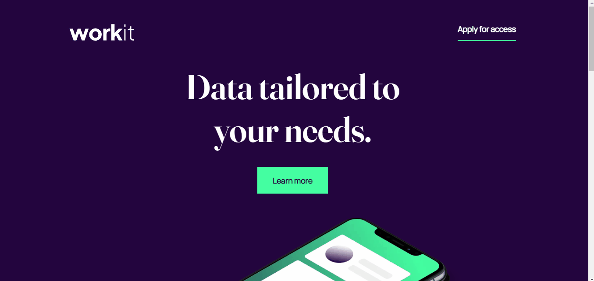
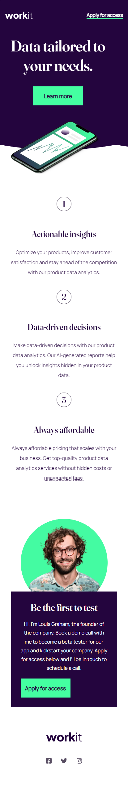

# Frontend Mentor - Workit landing page solution

Esta é a minha solução para o desafio [Workit landing page challenge do Frontend Mentor](https://www.frontendmentor.io/challenges/workit-landing-page-2fYnyle5lu). 

## Table of contents

- [Overview](#overview)
  - [O Desafio](#o-desafio)
  - [Screenshots](#screenshots)
  - [Links](#links)
- [Tecnologias utilizadas](#tecnologias-utilizadas)

## Overview

### O Desafio

Desenvolver e apresentar uma página na qual o usuário seja capaz de:

- Visualizar o melhor layout de acordo com o dispositivo em que estiver acessando;
- Observar as alterações de status de hover nos botões e ícones.

### Screenshots

### Links

- [Minha Solução](https://www.frontendmentor.io/solutions/workit-landing-page-responsive-with-html-and-css-6R59ABfAJ2)
- [Live Site](https://guihcastro.github.io/Frontend-Mentor-Workit-Landing-Page-Responsive/)

## Tecnologias utilizadas

-  HTML5 semântico;
-  CSS para estilização e responsividade.
